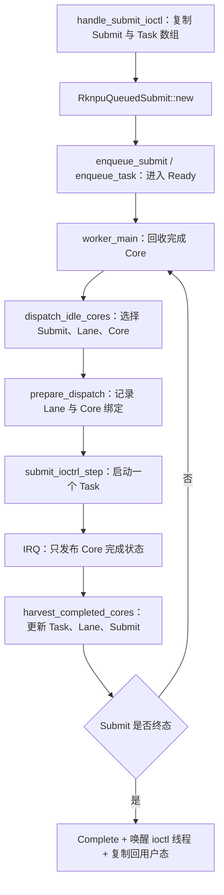

1.RK3588 官方 RKNN 确实支持 1/2/3 核组合和单模型多核执行，但公开接口只提供 Core mask、run/wait 等控制多核心数量，不公开底层 task 的切分细节，不能保证任意单个 Task 都能三核满载。

假如一个视频模型做推理，用户态最容易控制的最小调度单位通常是：

**一次 inference request，例如一帧视频 = 一次 `rknn_run()`。**  

Worker 取一帧当task调度， 从应用层来看这个就是最小task，**做多帧并行计算时就是这个独立的多个task在多个npu上运行,这样可以保证任务多的情况下多核一直吃满。**

官方也支持单帧推理使用多核 “single model on multiple cores”：[`CHANGELOG.md#L93-L103`](https://github.com/airockchip/rknn-toolkit2/blob/master/CHANGELOG.md#L93-L103)， **允许一帧使用多个npu,但是不能保证三个 Core 都能一直吃满**，而且涉及到单帧切分，这部分官方公开 API 没有提供底层 Task 切分细节  

2.NPU 最小 Task怎么划分的？

对于**标准 RKNN 模型**的底层硬件工作边界由 RKNN Compiler/Runtime 内部形成，公开 API 并不暴露一个 inference 最终对应多少个底层 `RknpuTask`，也不允许用户直接指定某个硬件 Task 的边界。

3.当前RKNPU的设定：最小硬件调度单位是 `RknpuTask`，用户态测试程序生成 regcmd 和 `RknpuTask[]`，所以 Task 边界目前主要由用户态程序定义；

> 前提：一个最小 `RknpuTask` 必须已经是一个可以独立下发到某个 NPU Core、从开始一直执行到完成 IRQ 的完整硬件执行单元。**读可以共享，写分区独立，Task间有依赖关系要处理好**。

每个 Task 必须指向一份完整可执行的 regcmd，并具备明确的输入、输出、资源和完成状态。多个Task 被集合进一个 Submit，再由 Scheduler 在运行时把各 Lane 当前可执行的 Task 动态派发到允许且空闲的物理 NPU Core；Task 完成后通过 IRQ 回收并推进 Lane，直到 Submit 内全部 Task 完成。

           		Submit
                   │
       ┌───────────┼───────────┐
       ▼           ▼           ▼
     lane0       lane1       lane2
     T0 T1       T2 T3       T4 T5
       │           │           │
       ▼           ▼           ▼
     core0       core1       core2

**现在已经具备多个 Submit 同时占用不同 Core 的能力以及不同Task可以并行计算，但是不能一个task同时占用多核计算。**


3.内核 Scheduler 已经实现 Submit 级 Ready/Running/Complete、priority、logical lane、physical `core_binding`、三路 IRQ completion 回收以及“一个 `RknpuTask` → 一个 Core”的非阻塞硬件派发。它已经具备多个 Submit/Job 同时占用不同 Core 的能力，但由于 Ready/Running 是 Submit 级、Task 在固定 lane range 内顺序推进且采用 Running-first，因此还不是全局 Task work-stealing，


以 core_scaling_benchmark.c 为例，测试程序为每个独立矩阵任务生成一份 regcmd，并构造一个 rknpu_task  

```
core_scaling_benchmark.c:437–481。
```

**生成硬件寄存器命令 `regcmd`**

**构造 `RknpuTask` 描述符，并决定一个 Task 对应哪一份 regcmd**

然后把构造的那些task封装成一个submit进行提交

现在的最小task拆分是这样的

RknpuTask数据结构：

```
测试程序
   │
   ├─ 决定要算什么
   │
   ├─ 决定怎么拆任务
   │
   ├─ 为每个任务生成独立 regcmd
   │
   └─ 构造 RknpuTask[]
            │
            ▼
         Submit
            │
            ▼
   		Scheduler
            │
   只负责调度分发已经拆好的 Task
            │
       ┌────┼────┐
       ▼    ▼    ▼
     NPU0 NPU1 NPU2
        
```

```
自己生成 regcmd
↓
自己构造 RknpuTask
↓
自己定义 hardware Task 边界
```

自由度最大，但你必须自己保证每个 Task 的：

```
DMA
寄存器配置
输入输出
依赖
中间buffer
完成中断
```


用户态测试程序负责定义 Task 是什么，驱动 scheduler 负责派发Task 选择NPU Core

所以这并不是编译器都划分好的

当前 scheduler 不负责把一个矩阵自动拆成三个 Task；它只负责把测试程序已经准备好的 `RknpuTask[]` 分配给不同 Core。

什么可以并行：

相互独立的任务可以，独立的task比如多路视频帧、多个独立输入、多个请求

> 标准 RKNN 是怎么做“任务分解 + 硬件命令生成”https://github.com/airockchip/rknn-toolkit2/blob/master/rknn-toolkit2/examples/onnx/yolov5/test.py
>
> 假如一个视频模型做推理，最自然、也是用户最容易控制的最小调度单位通常是：
>
> > **一次 inference request，例如一帧视频 = 一次 `rknn_run()`。**  
> >
> > Worker 取一帧当task调度， 从应用层来看这个Task就是最小task
> > 但是这个task还会在RKNN继续分解
> >
> > 你做多帧 并行计算时就是独立的多个task在多个npu上运行
> >
> > 官方也支持 单帧 多核， 允许一帧使用多个npu,但是不能保证三个 Core 都能一直吃满
>
> 官方公开 API 没有提供底层 Task 切分细节  
>
> **这部分给出官方代码示例和行号链接**

现在的划分就是划分为已经存在多个独立 `RknpuTask` 后，怎么动态分给三个 Core。

## **一次 NPU 计算任务的完整执行过程**

用户态：分配 DMA Buffer、生成寄存器命令与 Task：划分主要在这

用户态：把多个预构建 Task 组织成 Submit，并定义三核 lane

submit ioctl：复制用户 Task，入队，然后阻塞等待

## Scheduler：Ready → Running，选择 lane 与空闲 Core

## IRQ 与完成回收：Task 完成边界就是当前调度切换点

##  NPU 硬件：PC 执行 regcmd，CNA/CORE/DPU 完成任务计算

Submit 全部完成复制回用户态

划分任务主要是在第一步  调度task边界主要在IRQ 与完成回收这一步


## ioctl：复制用户 Task，入队，然后阻塞等待：drivers/rknpu/src/service/ioctl.rs:124–181。

但是现在已经初步实现 “用户线程阻塞、内核异步执行，”采用协作式后台Worker完成NPU任务的异步派发、回收与续派。

 handle_submit_ioctl() 复制提交进行阻塞的等待

一次调用把一个 queued task 绑定到一个 physical core
IRQ 与完成回收：Task 完成边界就是当前调度切换点

## 7. 一个Submit 的完整调度流程



### 

现在主要的问题：

最小任务划分边界:怎么把一个大task怎么拆成多个 独立的小task 这个“独立” 不好控制  同时任务划分太小不好，现在RKNPU驱动将每个矩阵计算设置为一个task就很好，而且用户态去设置更灵活 

 现在用户态测试程序负责定义 Task 是什么，驱动 scheduler 负责决定 Task 去哪个 NPU Core


我想下一步还是完善现在的要做的”用户态阻塞，内核非阻塞“异步协程调度完善好

Linux RKNN 已经可以做真正的 non-blocking run

目前官方 `rknn_run_extend` 有：

```
typedef struct _rknn_run_extend {
    uint64_t frame_id;
    int32_t  non_block;
    int32_t  timeout_ms;
    int32_t  fence_fd;
} rknn_run_extend;
```

其中 `non_block != 0` 表示非阻塞运行。

并且官方现在已经单独提供：

```
rknn_run()
rknn_wait()
```

## 尚未实现真正的协程事件调度

### 1. Worker仍在轮询

现在有硬件任务在执行时，worker仍然循环：

```
yield_now();
harvest_completed_cores();
```

也就是：

```用户态Submit仍然是同步接口
让出CPU
→ 再次被调度
→ 检查IRQ状态
→ 没完成继续让出CPU
```

### 用户态Submit仍然是同步接口

当前`handle_submit_ioctl()`固定执行：

```
enqueue_submit(...);
wait_for_submit(...);
take_terminal_submit(...);
```

### 3. 没有Task的全局动态Ready队列池

当前Ready队列主要是Submit级队列；Submit内部Task仍按逻辑lane的连续范围组织。

因此还不是：

```
30个独立Task全部进入全局Ready池
→ 任意Core完成
→ 动态领取下一个Task
```

而是：

```
每条lane在自己的Task范围内顺序推进，开始计算前就已经分配好了
```

这样会导致运行比较慢的lane一直占用一个核心 并且有可能另外两个核心空闲了也不能从这个lane中分配任务去执行

这个是在用户态可以设置的


## IRQ 没有直接唤醒 scheduler worker


你现在代码里：

```
IRQ
 ↓
irq_status
```

之后没有直接唤醒 scheduler worker。

下一步应该是内核Worker：IRQ驱动的协程式调度
事件驱动而不是Worker反复yield_now()检查

1. 先改 IRQ → worker：IRQ 只发布 irq_status 并通过 IRQ-safe event 唤醒 scheduler worker；把 has_inflight 时的 yield-polling 改成 listen → recheck → wait。
2. 再实现真正 NONBLOCK Submit：当前 ABI 已定义 RKNPU_JOB_NONBLOCK，但 handle_submit_ioctl() 仍固定 blocking。建议拆成 enqueue_submit() 立即返回 submit_id/handle。

当前实际是：

```
用户线程
  ↓
blocking ioctl
  ↓
handle_submit_ioctl()
  ↓
enqueue_submit()
  ↓
wait_for_submit()
  ↓
WaitQueue睡眠
```

最终真正想实现的是：

```
                 CPU Coroutine
                       │
                 prepare input
                       │
                       ▼
              submit_async()
                       │
              return SubmitFuture
                       │
                       ▼
                 future.await
                       │
              Poll::Pending
                       │
                       ▼
             Coroutine Suspend
                       │
              CPU跑其他Coroutine
                       │
───────────────────────┼────────────────────
                       │
                 Driver Scheduler
                       │
             Ready / Running Queue
                       │
                 Lane → Core
                       │
            ┌──────────┼──────────┐
            ▼          ▼          ▼
          NPU0       NPU1       NPU2
            │          │          │
            └───── completion ────┘
                       │
                      IRQ
                       │
              publish irq_status
                       │
                  wake worker
                       │
             harvest completion
                       │
               dispatch next
                       │
              Submit terminal
                       │
                  Waker.wake
───────────────────────┼────────────────────
                       │
                 Coroutine Ready
                       │
                 resume execution
```


回答

```
        给一个“大任务 Job”
                ↓
       先看这个任务能不能拆
                ↓
      再看此刻三个 NPU 的状态
                ↓
   ┌────────────┴────────────┐
   │                         │
  能拆                      不能拆
   │                         │
按当前资源拆成              给出原因
1/2/3 个子 Task               |
   │                         │
分给多个 NPU          只占需要的 NPU
   │                         │
提高该任务速度         其余 NPU 去干别的任务
```

现在是完成

给我一个“很多tasks”再看此刻三个 NPU 的状态 分配NPU

运行时任务分解

现在已经实现 Job之间并行了吧    多个Job分别占不同Core
